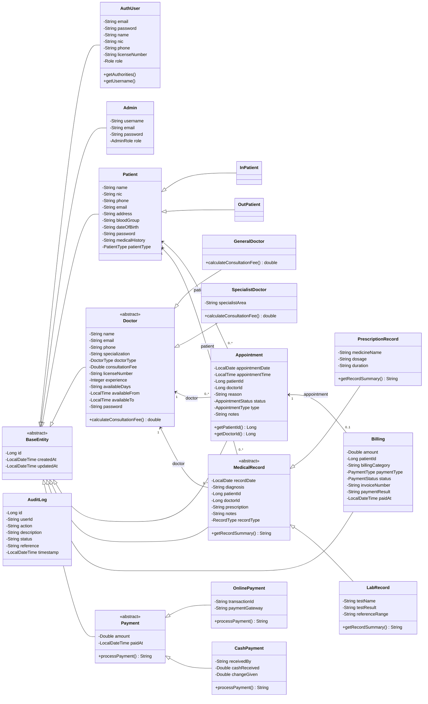

# Medical Appointment Scheduling System - Class Diagram

This diagram summarizes the main backend classes in `Backend/src/main/java/com/medicalapp`.
It focuses on the domain model and Spring layer dependencies used by the application.

## Backend Layer Diagram

```mermaid
classDiagram
direction TB

class PatientController
class DoctorController
class AppointmentController
class MedicalRecordController
class BillingController
class AdminController
class AuthController
class PatientDashboardController

class IPatientService {
  <<interface>>
}
class IDoctorService {
  <<interface>>
}
class IAppointmentService {
  <<interface>>
}
class IMedicalRecordService {
  <<interface>>
}
class IBillingService {
  <<interface>>
}
class IAdminService {
  <<interface>>
}

class PatientService
class DoctorService
class MedicalRecordService
class BillingService
class AdminService

class FileStorageUtil~T~ {
  -String filePath
  +writeToFile(List~T~ data, Function mapper)
  +readFromFile(Function mapper) List~T~
}

class FilePatientRepository
class FileDoctorRepository
class FileAppointmentRepository
class FileMedicalRecordRepository
class FileBillingRepository
class FileAdminRepository
class FileUserRepository
class FileAuditRepository

class PatientRepository {
  <<JpaRepository>>
}
class DoctorRepository {
  <<JpaRepository>>
}
class AppointmentRepository {
  <<JpaRepository>>
}
class MedicalRecordRepository {
  <<JpaRepository>>
}
class BillingRepository {
  <<JpaRepository>>
}
class AdminRepository {
  <<JpaRepository>>
}
class UserRepository {
  <<JpaRepository>>
}
class AuditLogRepository {
  <<JpaRepository>>
}

PatientController --> IPatientService
DoctorController --> IDoctorService
AppointmentController --> IAppointmentService
MedicalRecordController --> IMedicalRecordService
BillingController --> IBillingService
AdminController --> IAdminService
PatientDashboardController --> IPatientService
PatientDashboardController --> IAppointmentService
PatientDashboardController --> IMedicalRecordService
PatientDashboardController --> IBillingService
AuthController --> FileUserRepository
AuthController --> FilePatientRepository
AuthController --> FileDoctorRepository

IPatientService <|.. PatientService
IDoctorService <|.. DoctorService
IMedicalRecordService <|.. MedicalRecordService
IBillingService <|.. BillingService
IAdminService <|.. AdminService

PatientService --> FilePatientRepository
PatientService --> FileUserRepository
PatientService --> FileAppointmentRepository
DoctorService --> FileDoctorRepository
DoctorService --> FileUserRepository
DoctorService --> FileAppointmentRepository
MedicalRecordService --> FileMedicalRecordRepository
MedicalRecordService --> FilePatientRepository
MedicalRecordService --> FileDoctorRepository
BillingService --> FileBillingRepository
BillingService --> FileAppointmentRepository
AdminService --> FileAdminRepository
AdminService --> FileUserRepository

FilePatientRepository --> FileStorageUtil
FileDoctorRepository --> FileStorageUtil
FileAppointmentRepository --> FileStorageUtil
FileMedicalRecordRepository --> FileStorageUtil
FileBillingRepository --> FileStorageUtil
FileAdminRepository --> FileStorageUtil
FileUserRepository --> FileStorageUtil
FileAuditRepository --> FileStorageUtil
```

## Notes

- `AuthUser` in the diagram represents `com.medicalapp.auth.entity.User`; the alias avoids confusion with `com.medicalapp.common.model.User`.
- The `model` package contains older serializable `Patient`, `Doctor`, and `Appointment` classes. The active repositories, services, and controllers mainly use the JPA-style classes under each `entity` package.
- `AppointmentController` and `PatientDashboardController` reference `IAppointmentService`, but the matching service files were not present in the scanned source tree.
